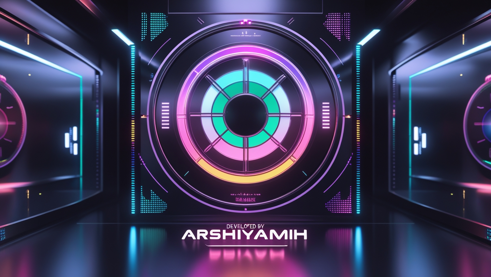

# Color Palette Generator 🎨🚀
A futuristic and stylish tool for generating stunning color palettes with a luxurious neon cyber-tech aesthetic. Built using **HTML, CSS, and JavaScript** for a smooth and interactive experience.
[live demo](https://arshiya-mh.github.io/RandomColorPlatters/)
## 📌 Features
✅ Instantly generates unique color palettes 🎭🎨  
✅ Sleek and modern UI with a futuristic vibe 🌌💡  
✅ User-friendly and interactive design 🖥️✨  
✅ Click to generate new palettes with ease ⚡  
✅ Perfect for designers and creatives seeking inspiration 🌈  

## 🛠️ Technologies Used
- HTML
- CSS
- JavaScript

## 📥 Installation & Usage
1. **Download or clone** the repository.
2. Open the `index.html` file in your browser.
3. Click the button to generate new color palettes.

## 📌 Screenshot

## 📜 License
This project is open-source and free to use.

🚀 **Developed by Arshiya MH**
